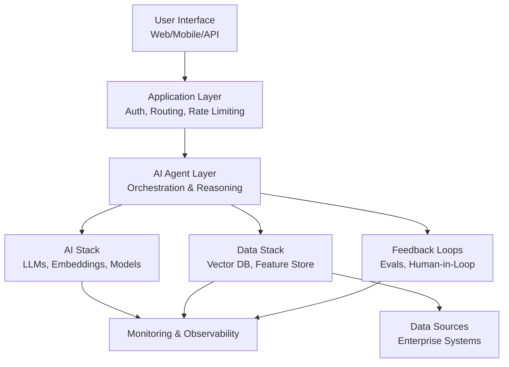

# AI Use Case Blueprint: [Use Case Name]

> **Strategic Positioning**: Q[1/2/3/4] - [Quadrant Name]
> **Target Market**: [Market segment]
> **Expected ROI**: [Percentage or dollar amount]
> **Timeline**: [Q1-Q4 target delivery]

---

## Executive Summary

### Use Case Overview

**Name**: [Clear, business-focused name]

**One-Line Description**: [Single sentence capturing the essence]

**Strategic Quadrant**: Q[1/2/3/4] - [Quadrant Name]
- **AI Actions**: [Know-how / Actionable]
- **Human Involvement**: [Intervention / Autonomous]

**Problem Statement**: [2-3 sentences describing the core problem being solved, who faces it, and why it matters]

**Target Users**: [Primary user personas and their roles]

**Expected Business Impact**:
- [Metric 1]: [Quantified improvement] (e.g., Reduce support costs by 30%)
- [Metric 2]: [Quantified improvement] (e.g., Improve response time from 4 hours to 15 minutes)
- [Metric 3]: [Quantified improvement] (e.g., Increase customer satisfaction by 25%)

---

### Value Proposition & ROI

**Customer Value**:
- [Benefit 1]: [Specific value delivered to end users]
- [Benefit 2]: [Pain point resolved or friction removed]
- [Benefit 3]: [New capability or competitive advantage]

**Business Value**:
- **Revenue Impact**: [New revenue, expansion, retention improvement]
- **Cost Savings**: [Operational costs reduced, efficiency gains]
- **Strategic Value**: [Market positioning, competitive differentiation, ecosystem benefits]

**ROI Calculation**:
```
Annual Benefits:
  Revenue increase: $[amount]
  Cost savings: $[amount]
  Total benefit: $[amount]

Annual Costs:
  Development (one-time): $[amount] / 3 years = $[amount/year]
  Infrastructure: $[amount]
  Operations: $[amount]
  Total cost: $[amount]

Net ROI: ([Benefits - Costs] / Costs) × 100 = [X]%
Payback Period: [X] months
```

**Time to Value**: [How long until customers/business see benefits]

**Key Assumptions**:
1. [Critical assumption 1 that ROI depends on]
2. [Critical assumption 2 that ROI depends on]
3. [Critical assumption 3 that ROI depends on]

---

### Key Risks & Mitigations

**Risk 1: [Risk Name]**
- **Description**: [What could go wrong]
- **Impact**: [High/Medium/Low]
- **Likelihood**: [High/Medium/Low]
- **Mitigation**: [How we reduce or eliminate this risk]

**Risk 2: [Risk Name]**
- **Description**: [What could go wrong]
- **Impact**: [High/Medium/Low]
- **Likelihood**: [High/Medium/Low]
- **Mitigation**: [How we reduce or eliminate this risk]

**Risk 3: [Risk Name]**
- **Description**: [What could go wrong]
- **Impact**: [High/Medium/Low]
- **Likelihood**: [High/Medium/Low]
- **Mitigation**: [How we reduce or eliminate this risk]

**Governance Requirements**:
- [Approval level needed based on risk profile]
- [Oversight mechanisms (quarterly reviews, steering committee, etc.)]
- [Escalation triggers and procedures]

---

### Recommendation

**Go / No-Go Assessment**: [GO / NO-GO / CONDITIONAL]

**Rationale**:
[2-3 paragraphs explaining the recommendation based on value, risk, readiness, and strategic fit]

**Prerequisites for Success**:
1. [Critical prerequisite 1]
2. [Critical prerequisite 2]
3. [Critical prerequisite 3]

**Recommended Next Steps**:
1. [Immediate action 1]
2. [Immediate action 2]
3. [Immediate action 3]

**Decision Criteria for Leadership**:
- [Key question or factor executives should consider]
- [Trade-off that requires executive judgment]
- [Strategic choice between alternatives]

---

## Business & Monetization

### Detailed Value Proposition

**Jobs to Be Done**: [Describe the functional, emotional, and social jobs this solves for users]

**Competitive Alternatives**: [Current solution users have, competitive products, and substitutes]

**Unique Differentiation**:
- [Key differentiator 1 and why it's defensible]
- [Key differentiator 2 and competitive advantage]

**Sustainable Moat**: [Type of moat (network effects/data/technology) and why it persists 12-24 months]

---

### Target Market & Segments

**Market Sizing**:
- **TAM**: [Total addressable market size and growth rate]
- **SAM**: [Serviceable addressable market - realistic segment we can serve]
- **SOM**: [Serviceable obtainable market - realistic capture in 12-24 months]

**Primary Customer Segment**: [Description, size, pain points, and willingness to pay]

**Secondary Customer Segment**: [Description, size, pain points, and willingness to pay]

---

### Competitive Landscape

**Direct Competitors**:

**Competitor 1: [Name]**
- **Offering**: [Their AI product/feature]
- **Strengths**: [What they do well]
- **Weaknesses**: [Where they fall short]
- **Pricing**: [Their pricing model]
- **Market Position**: [Leader/Challenger/Niche]

**Competitor 2: [Name]**
- **Offering**: [Their AI product/feature]
- **Strengths**: [What they do well]
- **Weaknesses**: [Where they fall short]
- **Pricing**: [Their pricing model]
- **Market Position**: [Leader/Challenger/Niche]

**Indirect Competitors & Substitutes**:
- [Alternative solution 1 and why users might choose it]
- [Alternative solution 2 and why users might choose it]

**Competitive Positioning**:
- **Our Position**: [How we position vs. competitors]
- **Key Battleground**: [Where competition will be won/lost]
- **Competitive Response**: [How competitors might react]

---

### Pricing Strategy

**Pricing Archetype Analysis**:

*See `templates/pricing-archetypes.md` for detailed comparison of all 4 models*

**Recommended Model**: [Subscription / Consumption / Outcome-Based / Hybrid]

**Rationale**:
[2-3 paragraphs explaining why this pricing model best fits the AI autonomy level, proven value, customer preferences, and business model]

**Detailed Pricing Structure**:

**Tier 1: [Name]** (e.g., Starter, Free, Basic)
- **Price**: $[amount] per [unit] per [time period]
- **Included**: [Features and usage limits]
- **Target Customer**: [Who this tier is for]
- **Conversion Goal**: [What % should upgrade]

**Tier 2: [Name]** (e.g., Professional, Standard, Plus)
- **Price**: $[amount] per [unit] per [time period]
- **Included**: [Features and usage limits]
- **Target Customer**: [Who this tier is for]
- **Revenue Target**: [Expected contribution to revenue]

**Tier 3: [Name]** (e.g., Enterprise, Premium, Ultimate)
- **Price**: $[amount] per [unit] per [time period] or Custom
- **Included**: [Features and usage limits]
- **Target Customer**: [Who this tier is for]
- **Strategic Value**: [Why we offer this tier]

**Usage Overages** (if hybrid model):
- **Overage Pricing**: $[amount] per [unit] above included limits
- **Soft Limits**: [Warnings before overages apply]
- **Hard Limits**: [Maximum usage caps]

**Examples**:
- Small customer (10 users): $[amount]/month
- Medium customer (100 users): $[amount]/month
- Enterprise customer (1000 users): $[amount]/month

---

### Unit Economics

**Cost Structure**:
- **Data Preparation**: $[amount] per [unit]
- **Model Inference**: $[amount] per [request/token/transaction]
- **Infrastructure**: $[amount] per [user/month]
- **Operations & Support**: $[amount] per [customer]
- **Total Cost per [Unit]**: $[amount]

**Revenue per [Unit]**: $[amount]

**Gross Margin**: ([Revenue - Cost] / Revenue) × 100 = [X]%

**Target Margin**: [X]% (benchmark for AI products: 40-70%)

**LTV:CAC Ratio**:
```
Customer Lifetime Value (LTV):
  Average revenue per customer per year: $[amount]
  Average customer lifespan: [X] years
  Gross margin: [X]%
  LTV = $[amount] × [X years] × [X]% = $[amount]

Customer Acquisition Cost (CAC):
  Sales & marketing cost per customer: $[amount]

LTV:CAC Ratio = [X]:1

Target: >3:1 for healthy SaaS, >2:1 acceptable for AI given higher costs
```

**Break-Even Analysis**:
- **Fixed Costs**: $[amount]/month (development amortized, operations, team)
- **Variable Cost per Unit**: $[amount]
- **Revenue per Unit**: $[amount]
- **Contribution Margin**: $[amount]
- **Break-Even Volume**: [X units/customers]
- **Break-Even Timeline**: [X months] from launch

---

## User Experience & Adoption

### User Personas

**Primary Persona: [Name/Role]** - [Demographics, goals, pain points, tech savviness, AI familiarity, success criteria]

**Secondary Persona: [Name/Role]** - [Demographics, goals, pain points, tech savviness, AI familiarity, success criteria]

---

### User Flow

**Awareness → Onboarding → Activation → Engagement → Advocacy**

- **Awareness**: [How users discover the capability]
- **Onboarding**: [First-time setup and education, time to first value]
- **Activation**: [The "aha moment" - when users experience core value, target timeframe]
- **Engagement**: [Regular usage patterns, habit triggers, success metrics (DAU/MAU)]
- **Advocacy**: [Referral and expansion mechanics, NPS targets]

---

### Adoption Strategy

**Quarterly Goals**: [Q1: X% activation, Q2: X% DAU, Q3: X% market penetration, Q4: X% paid tier]

**Key Tactics**:
- **Onboarding**: [Education approach, time to first value target]
- **Engagement**: [Behavioral nudges, usage triggers]
- **Trust Building**: [Social proof, transparency, responsible AI communication]
- **Feedback**: [Collection mechanisms, continuous improvement loop]

---

### Change Management

**Organizational Impact**:
- **Roles Affected**: [Which roles/teams will change]
- **Process Changes**: [Workflows that will be modified]
- **Skill Requirements**: [New competencies needed]
- **Resistance Factors**: [Why people might resist]

**Change Management Plan**:

**Phase 1: Awareness & Buy-In**
- **Activities**: [Executive sponsorship, vision communication]
- **Stakeholders**: [Who needs to champion this]
- **Timeline**: [When]
- **Success Metrics**: [Awareness surveys, stakeholder alignment]

**Phase 2: Training & Enablement**
- **Activities**: [Training programs, documentation, office hours]
- **Stakeholders**: [End users, managers, administrators]
- **Timeline**: [When]
- **Success Metrics**: [Training completion, certification, competency assessments]

**Phase 3: Pilot & Refinement**
- **Activities**: [Limited rollout, feedback collection, iteration]
- **Stakeholders**: [Early adopters, power users]
- **Timeline**: [When]
- **Success Metrics**: [Pilot engagement, feedback quality, issue resolution]

**Phase 4: Scaled Rollout**
- **Activities**: [Phased expansion, success stories, community building]
- **Stakeholders**: [Entire organization]
- **Timeline**: [When]
- **Success Metrics**: [Adoption rate, proficiency, satisfaction]

---

### Success Criteria & Engagement Metrics

**Activation Metrics**:
- **Metric**: [What defines an "activated" user]
- **Target**: [X]% of new users activate within [Y] days
- **Measurement**: [How we track this]

**Engagement Metrics**:
- **Daily Active Users (DAU)**: [Target number or %]
- **Weekly Active Users (WAU)**: [Target number or %]
- **Monthly Active Users (MAU)**: [Target number or %]
- **DAU/MAU Ratio**: [Target %] (stickiness indicator)

**Feature Usage Metrics**:
- **Feature 1**: [X]% of users, [Y] times per week
- **Feature 2**: [X]% of users, [Y] times per week
- **Feature 3**: [X]% of users, [Y] times per week

**Satisfaction Metrics**:
- **Net Promoter Score (NPS)**: Target >[X]
- **Customer Satisfaction (CSAT)**: Target >[X]%
- **User Trust**: [X]% report trusting AI outputs

**Retention Metrics**:
- **30-Day Retention**: [X]%
- **90-Day Retention**: [X]%
- **12-Month Retention**: [X]%
- **Churn Rate**: <[X]% monthly

---

## Technical Architecture

*Note: This is a high-level architecture suitable for executive and PM audiences. Detailed technical design will be developed during implementation planning.*

### High-Level System Diagram

**ASCII Diagram**:
```
┌─────────────────────────────────────────────────────────────────┐
│                         User Interface                           │
│  (Web App / Mobile / Slack / API / Embedded Widget)             │
└────────────────────────────┬────────────────────────────────────┘
                             │
┌────────────────────────────▼────────────────────────────────────┐
│                      Application Layer                          │
│  • Authentication & Authorization                               │
│  • Request Routing & Rate Limiting                              │
│  • Session Management                                           │
│  • Human-in-Loop Orchestration                                  │
└────────────────────────────┬────────────────────────────────────┘
                             │
┌────────────────────────────▼────────────────────────────────────┐
│                        AI Agent Layer                           │
│  • Agent Orchestration (Multi-Agent Coordination)               │
│  • Reasoning & Planning                                          │
│  • Tool Selection & Execution                                    │
│  • Response Generation                                           │
└──────┬─────────────────────┬──────────────────────┬─────────────┘
       │                     │                      │
┌──────▼──────┐      ┌──────▼──────┐       ┌──────▼──────┐
│   AI Stack   │      │ Data Stack  │       │  Feedback   │
│              │      │             │       │   Loops     │
│ • LLM APIs   │      │ • Vector DB │       │ • Evals     │
│ • Embedding  │      │ • Feature   │       │ • Human     │
│   Models     │      │   Store     │       │   Feedback  │
│ • Fine-tuned │      │ • Data      │       │ • Metrics   │
│   Models     │      │   Pipeline  │       │ • Retraining│
└──────┬──────┘      └──────┬──────┘       └──────┬──────┘
       │                     │                      │
┌──────▼─────────────────────▼──────────────────────▼──────┐
│               Monitoring & Observability                  │
│  • Performance Metrics (Latency, Cost, Accuracy)          │
│  • Safety Monitoring (Guardrails, Bias, Harmful Content)  │
│  • Compliance Logging (Audit Trail, Data Lineage)         │
└───────────────────────────────────────────────────────────┘

Data Sources: [Enterprise Systems, APIs, Databases, Real-time Streams]
```

**Mermaid Diagram**:


---

### Component Specifications

**Data Ingestion & Pipeline**:
- **Data Sources**: [List systems: CRM, Support Tickets, Knowledge Base, etc.]
- **Ingestion Method**: [Real-time streaming / Batch ETL / API polling]
- **Data Volume**: [GB/TB per day, request rate]
- **Data Quality**: [Validation, cleansing, enrichment requirements]
- **Data Governance**: [Access control, encryption, retention policies]

**Feature Store**:
- **Purpose**: [Centralized feature management for model training and serving]
- **Features Managed**: [User features, contextual features, historical features]
- **Freshness Requirements**: [Real-time / Near-real-time / Batch]
- **Versioning**: [Feature version control and lineage tracking]

**Model Serving Infrastructure**:
- **Deployment Pattern**: [Real-time API / Batch inference / Edge deployment]
- **Serving Framework**: [Options: SageMaker, Vertex AI, KServe, Custom]
- **Latency Requirements**: [p50, p95, p99 targets]
- **Throughput**: [Requests per second, concurrent users]
- **Auto-Scaling**: [Scaling triggers and limits]

**Agent Orchestration**:
- **Orchestration Engine**: [LangChain / AutoGen / CrewAI / Custom]
- **Agent Types**: [Retrieval agent, Analysis agent, Action agent]
- **Inter-Agent Communication**: [Message passing, shared memory, coordination protocol]
- **Tool Integration**: [APIs, databases, external services agents can access]

**API Layer**:
- **API Design**: [RESTful / GraphQL / gRPC]
- **Authentication**: [OAuth 2.0 / API Keys / JWT]
- **Rate Limiting**: [Requests per minute by tier]
- **Documentation**: [OpenAPI spec, developer portal]

**Monitoring & Observability**:
- **Performance Metrics**: [Latency (p50/p95/p99), throughput, error rates]
- **Cost Metrics**: [Token usage, API costs, infrastructure costs per request]
- **Quality Metrics**: [Model accuracy, relevance scores, hallucination rates]
- **Dashboards**: [Real-time operational dashboard, executive KPI dashboard]
- **Alerting**: [PagerDuty/Slack alerts for SLA breaches, cost spikes, quality degradation]

---

### Integration Points

**Enterprise System Integrations**:
- **System 1: [Name]**: [Purpose, integration method, data flow]
- **System 2: [Name]**: [Purpose, integration method, data flow]
- **System 3: [Name]**: [Purpose, integration method, data flow]

**Third-Party Services**:
- **LLM Providers**: [OpenAI / Anthropic / Azure OpenAI]
- **Embedding Models**: [OpenAI Ada / Sentence Transformers / Custom]
- **Vector Database**: [Pinecone / Weaviate / Chroma / Qdrant]
- **Cloud Provider**: [AWS / Azure / GCP]

**Authentication & SSO**:
- [SAML / OAuth / Active Directory integration]

---

### Scalability Considerations

**Current Scale**:
- **Users**: [Expected concurrent users]
- **Requests**: [Requests per second]
- **Data Volume**: [GB/TB of data]

**12-Month Scale**:
- **Users**: [10x? 100x?]
- **Requests**: [10x? 100x?]
- **Data Volume**: [10x? 100x?]

**Scaling Strategy**:
- **Horizontal Scaling**: [Add more servers/instances]
- **Caching**: [Response caching, embedding caching, model output caching]
- **Model Routing**: [Route simple queries to smaller/cheaper models]
- **Batch Processing**: [Combine requests where possible]
- **Edge Deployment**: [Deploy models closer to users for latency]

**Infrastructure Costs at Scale**:
- **Current**: $[amount]/month
- **12-Month Projected**: $[amount]/month
- **Cost per User**: $[amount]

---

## Economics & Cost

### Comprehensive Cost Breakdown

**Development Costs** (One-Time):
- **Product & Design**: $[amount] ([X] weeks, [Y] FTEs)
- **Engineering**: $[amount] ([X] weeks, [Y] FTEs)
- **Data Engineering**: $[amount] ([X] weeks, [Y] FTEs)
- **AI/ML Engineering**: $[amount] ([X] weeks, [Y] FTEs)
- **QA & Testing**: $[amount] ([X] weeks, [Y] FTEs)
- **Total Development**: $[amount]
- **Amortized Annual**: $[amount] (over 3 years)

**Data Costs** (Ongoing):
- **Data Acquisition**: $[amount]/month (if purchasing external data)
- **Data Storage**: $[amount]/month ([X] TB)
- **Data Processing**: $[amount]/month (ETL, transformation)
- **Data Labeling**: $[amount]/month (if manual labeling needed)
- **Total Data Costs**: $[amount]/month

**Infrastructure Costs** (Ongoing):
- **Compute (CPU)**: $[amount]/month
- **Compute (GPU)**: $[amount]/month (if training or inference)
- **Storage**: $[amount]/month
- **Networking**: $[amount]/month
- **Database**: $[amount]/month
- **Total Infrastructure**: $[amount]/month

**Model Costs** (Ongoing):
- **LLM API Costs**: $[amount]/month ($[amount] per 1M tokens × [X]M tokens)
- **Embedding API Costs**: $[amount]/month
- **Fine-Tuning Costs**: $[amount]/quarter (if applicable)
- **Model Hosting**: $[amount]/month (if self-hosted models)
- **Total Model Costs**: $[amount]/month

**Operations Costs** (Ongoing):
- **Monitoring & Observability**: $[amount]/month (tools, logging, metrics)
- **Support**: $[amount]/month (customer support, technical support)
- **Team Operations**: $[amount]/month (PMs, data scientists, engineers ongoing maintenance)
- **Total Operations**: $[amount]/month

**TOTAL MONTHLY COST**: $[amount]
**TOTAL ANNUAL COST**: $[amount]

---

### Scaling Cost Projections

**Cost Scaling Assumptions**:
- Linear scaling: [Which costs scale linearly with users]
- Sublinear scaling: [Which costs benefit from economies of scale]
- Fixed costs: [Which costs don't scale with usage]

**Projected Costs at Scale**:

| Metric | Current | 6 Months | 12 Months | 24 Months |
|--------|---------|----------|-----------|-----------|
| Users | [X] | [X] | [X] | [X] |
| Monthly Cost | $[X] | $[X] | $[X] | $[X] |
| Cost per User | $[X] | $[X] | $[X] | $[X] |
| Revenue | $[X] | $[X] | $[X] | $[X] |
| Margin | [X]% | [X]% | [X]% | [X]% |

---

### Cost Containment Strategies

**Key Strategies**:
- **Caching**: Response, embedding, and prompt caching (target: [X]% savings)
- **Model Routing**: Tiered models based on query complexity (target: [X]% savings)
- **Prompt Optimization**: Token reduction and output limits (target: [X]% savings)
- **Batch Processing**: Offline and aggregated processing (target: [X]% savings)
- **Infrastructure**: Auto-scaling, spot instances, reserved capacity (target: [X]% savings)

---

### Unit Economics

**Cost per User** (Monthly):
```
Data costs: $[X] / [Y] users = $[Z] per user
Infrastructure: $[X] / [Y] users = $[Z] per user
Model inference: $[X] / [Y] users = $[Z] per user
Operations: $[X] / [Y] users = $[Z] per user
Total: $[Z] per user per month
```

**Cost per Transaction/Interaction**:
```
Average tokens per interaction: [X]
Cost per 1M tokens: $[Y]
Cost per interaction: $[Z]
Interactions per user per month: [X]
Cost per user per month: $[Z]
```

**Gross Margin Analysis**:
```
Revenue per user: $[X]
COGS per user: $[Y]
Gross profit per user: $[Z]
Gross margin: [X]%

Target gross margin: [X]% (healthy AI SaaS: 50-70%)
```

**Break-Even Analysis**:
```
Fixed costs (monthly): $[X]
Variable cost per user: $[Y]
Revenue per user: $[Z]
Contribution margin: $[A] per user

Break-even users = Fixed costs / Contribution margin = [X] users
Current users: [Y]
Gap to break-even: [Z] users
Timeline to break-even: Q[X] (based on growth projections)
```

---

## Performance & Evaluations

### CLASSic Metrics Framework

**Cost**:
- **Metric**: Cost per inference, cost per user, cost per outcome
- **Target**: <$[amount] per [unit]
- **Tracking**: Monthly cost dashboard, unit economics tracking
- **Alerting**: Alert if costs exceed $[threshold] per [unit]

**Latency**:
- **Metric**: Response time (p50, p95, p99)
- **Target**: p95 <[X]ms for real-time use cases
- **Tracking**: APM tools (DataDog, New Relic), latency histograms
- **Alerting**: Alert if p95 >[X]ms for >5 minutes

**Accuracy**:
- **Metric**: Model accuracy, relevance, F1 score, NDCG (depending on use case)
- **Target**: >[X]% accuracy, >[Y]% relevance
- **Tracking**: Offline evaluation, A/B test results, human evaluation scores
- **Alerting**: Alert if accuracy drops below [X]%

**Safety**:
- **Metric**: Harmful output rate, guardrail trigger frequency, incident count
- **Target**: <[X]% harmful outputs, zero critical incidents
- **Tracking**: Guardrail logs, manual content review, user reports
- **Alerting**: Immediate alert for any critical safety incident

**Security**:
- **Metric**: Vulnerability scan results, prompt injection attempts blocked, data leakage incidents
- **Target**: Zero critical vulnerabilities, 100% prompt injection blocked
- **Tracking**: Security scanning tools, penetration testing, audit logs
- **Alerting**: Immediate alert for security breach attempts

**Interpretability**:
- **Metric**: Explanation quality scores, citation accuracy, user trust ratings
- **Target**: >[X]% of responses include citations, >[Y]% user trust
- **Tracking**: User surveys, explanation quality evals, citation validation
- **Alerting**: Alert if citation accuracy <[X]%

**Compliance**:
- **Metric**: Audit pass rate, policy adherence, regulatory alignment
- **Target**: 100% audit compliance, zero policy violations
- **Tracking**: Compliance dashboard, audit logs, quarterly reviews
- **Alerting**: Immediate alert for compliance violations

---

### Evaluation Strategy

**Offline Evaluation** (Pre-Deployment):
- **Groundedness**: Measure if outputs are grounded in source data
  - **Method**: LLM-as-judge, human evaluation
  - **Target**: >[X]% grounded responses
- **Relevance**: Measure if outputs address user query
  - **Method**: Semantic similarity, human ratings
  - **Target**: >[X]% relevance score
- **Hallucination Detection**: Measure false information rate
  - **Method**: Fact-checking against ground truth, human review
  - **Target**: <[X]% hallucination rate

**Online Evaluation** (Production):
- **A/B Testing**: Compare AI-powered vs. baseline
  - **Metrics**: User engagement, satisfaction, conversion
  - **Duration**: [X] weeks with [Y] users
- **Human-in-the-Loop Feedback**: Collect thumbs up/down, corrections
  - **Target**: >[X]% positive feedback
- **Continuous Monitoring**: Track metrics in real-time
  - **Dashboards**: Grafana, DataDog, custom dashboards

**Evaluation Cadence**:
- **Daily**: Automated evals on production traffic sample
- **Weekly**: Human evaluation on random sample (100-500 interactions)
- **Monthly**: Comprehensive model performance review
- **Quarterly**: Full evaluation report to governance board

---

### Benchmarks & Targets

**Model Performance**:
- **Baseline (Pre-AI)**: [Current performance without AI]
- **Target (AI-Powered)**: [Expected performance with AI]
- **Best-in-Class**: [Industry benchmark or competitor performance]

**Latency Benchmarks**:
- **Real-Time Use Cases**: <200ms p95
- **Conversational Use Cases**: <2s p95
- **Batch Processing**: <5 min per batch

**Quality Benchmarks**:
- **High-Stakes Decisions** (medical, financial): >95% accuracy
- **Customer-Facing Content** (support, marketing): >85% quality rating
- **Internal Tools** (search, summarization): >75% usefulness rating

**Cost Benchmarks**:
- **LLM API Costs**: <$0.01 per interaction for conversational AI
- **Infrastructure Costs**: <$5 per user per month at scale
- **Total COGS**: <30% of revenue for healthy margins

---

### Testing Approach

**Testing Types**:
- **Unit Testing**: Test individual components (data pipelines, API endpoints)
- **Integration Testing**: Test component interactions (RAG pipeline, agent workflows)
- **System Testing**: End-to-end testing (user query → response)
- **Performance Testing**: Load testing, stress testing, latency testing
- **Security Testing**: Penetration testing, prompt injection testing, adversarial testing
- **Bias Testing**: Fairness testing across demographics with synthetic data

**Quality Gates**:
- **Before Deployment**: All tests pass, accuracy >[X]%, latency <[Y]ms
- **Before Production Rollout**: A/B test shows >[X]% improvement
- **Before Scaling**: Cost per user <$[Y], no critical incidents

---

## Responsible AI & Governance

*Full framework in `templates/responsible-ai-framework.md`*

### High-Level RAI Principles

1. **Fairness**: Equitable treatment across user segments without bias or discrimination
2. **Transparency**: Explainable AI outputs, clear communication about capabilities and limitations
3. **Accountability**: Clear ownership, governance, and responsibility for AI decisions
4. **Privacy**: Data protection, user control, consent management, and regulatory compliance
5. **Safety**: Harm prevention, risk mitigation, robust guardrails against adverse outcomes

---

### Guardrails & Safety Measures

**Content Filtering**:
- **Input Guardrails**: Block harmful, offensive, or inappropriate user inputs
- **Output Guardrails**: Filter AI-generated content for safety, brand compliance
- **Implementation**: LLM-based classifiers, keyword filters, toxicity detection models

**Rate Limiting**:
- **Per-User Limits**: [X] requests per minute to prevent abuse
- **System-Wide Limits**: [Y] total requests per second for cost control
- **Throttling**: Gradual reduction for high-volume users

**Human-in-the-Loop Triggers**:
- **Confidence Threshold**: Escalate to human when AI confidence <[X]%
- **High-Stakes Decisions**: Require human approval for [specific scenarios]
- **User Override**: Allow users to request human review at any time

**Fallback Mechanisms**:
- **Model Failure**: Fallback to simpler model or pre-canned responses
- **API Timeout**: Graceful degradation, user-friendly error messages
- **Safety Violations**: Block output, log incident, escalate to review

---

### Bias Detection & Mitigation

**Detection & Mitigation**: [Methods for bias detection (demographic parity, equalized odds, synthetic testing) and mitigation strategies (data balancing, adversarial debiasing, post-processing, human review)]

**Monitoring**: [Fairness metrics dashboards, alerting thresholds, quarterly audit reports]

---

### Monitoring & Observability

**Real-Time Dashboards**:
- **Performance Dashboard**: Latency, throughput, error rates, cost per request
- **Quality Dashboard**: Accuracy, relevance, hallucination rate, user feedback
- **Safety Dashboard**: Guardrail triggers, harmful content rate, security incidents
- **Compliance Dashboard**: Policy violations, audit logs, regulatory metrics

**Drift Detection**:
- **Data Drift**: Monitor changes in input data distribution
- **Model Drift**: Track model performance degradation over time
- **Concept Drift**: Detect when user needs/expectations change
- **Alerting**: Alert when drift exceeds [X]% threshold

**Incident Response**:
- **Severity Levels**: SEV1 (critical), SEV2 (high), SEV3 (medium), SEV4 (low)
- **Response Times**: SEV1 <15min, SEV2 <1hr, SEV3 <4hr, SEV4 <24hr
- **Escalation**: Defined escalation paths to engineering, PM, legal, executive team
- **Post-Mortem**: Blameless post-mortems for all SEV1/SEV2 incidents

---

### Compliance Framework

**Applicable Regulations**: [List relevant regulations: GDPR, HIPAA, SOC 2, ISO 42001, NIST AI RMF, etc.]

**Key Requirements**: [Specific compliance requirements for this use case - data privacy, security controls, audit requirements, AI-specific governance]

---

### Governance Structure

**AI Governance Board**: [Members, cadence, responsibilities]

**Approval Workflows**: [Low/Medium/High risk approval paths]

**Review Process**: [Pre-deployment, post-deployment, and incident-triggered reviews]

**Audit Schedule**: [Internal (quarterly), external (annual), regulatory reporting]

---

### Audit Trail & Transparency

**Logging Requirements**:
- **User Actions**: All user inputs and AI responses
- **Model Decisions**: Predictions, confidence scores, reasoning
- **Human Overrides**: When and why humans intervened
- **Policy Changes**: All governance policy updates
- **Retention**: [X] months/years based on compliance requirements

**Transparency Communications**:
- **Model Card**: Public documentation of model capabilities, limitations, training data
- **Privacy Policy**: Clear explanation of data usage and AI decision-making
- **User Education**: In-app explanations, help docs, webinars on AI features
- **Incident Reports**: Public transparency reports for major incidents (if appropriate)

---

## Execution Roadmap

### Q1 - Foundation & Pilot

**Milestones**: [Data pipeline, model training, pilot deployment, monitoring infrastructure]

**Success Criteria**: [Model accuracy, latency, pilot NPS, cost targets, safety goals]

**Adoption Targets**: [X% activation, Y% DAU, Z interactions/user/week]

**Dependencies & Risks**: [Data access, resources, budget, mitigation strategies]

---

### Q2 - Beta & Scale Preparation

**Milestones**: [Beta launch, feedback loops, cost optimization, guardrails, A/B testing]

**Success Criteria**: [Improved accuracy, maintained latency, beta NPS, reduced costs, churn, bias metrics]

**Adoption Targets**: [X% activation, Y% WAU, Z% engagement, A% paid tier]

**Dependencies & Risks**: [Pricing approval, GTM materials, CS playbook, mitigation strategies]

---

### Q3 - Production Launch & GTM

**Milestones**: [GA launch, billing live, SLA tracking, team enablement, marketing campaign]

**Success Criteria**: [SLA targets, revenue goals, CSAT, support volume, incident targets]

**Adoption Targets**: [X% market awareness, Y% customer activation, Z% new acquisition, A% engagement]

**Dependencies & Risks**: [Launch coordination, sales alignment, onboarding materials, phased rollout plan]

---

### Q4 - Optimization & Growth

**Milestones**: [Cost optimization, model v2, expansion features, enterprise tier, annual planning]

**Success Criteria**: [Improved unit economics, NPS, expansion revenue, retention, positive margins]

**Adoption Targets**: [X% YoY growth, Y% paid tier, Z% upsell rate, A% net retention]

**Dependencies & Risks**: [2026 roadmap, budget approval, scaling plan, competitive monitoring]

---

## Appendix

### Glossary

- **CLASSic Metrics**: Cost, Latency, Accuracy, Safety, Security framework for AI evaluation
- **Hallucination**: AI-generated content that is factually incorrect or not grounded in source data
- **Guardrails**: Safety mechanisms to prevent harmful or inappropriate AI outputs
- **RAG**: Retrieval-Augmented Generation, technique combining retrieval with generation
- **LTV:CAC**: Customer Lifetime Value to Customer Acquisition Cost ratio
- **NPS**: Net Promoter Score, measure of customer satisfaction and loyalty

### Assumptions Log

**Business Assumptions**:
1. [Assumption 1]
2. [Assumption 2]
3. [Assumption 3]

**Technical Assumptions**:
1. [Assumption 1]
2. [Assumption 2]
3. [Assumption 3]

**Market Assumptions**:
1. [Assumption 1]
2. [Assumption 2]
3. [Assumption 3]

### Research Sources

**Internal Documents**:
- [Document 1]
- [Document 2]

**External Research**:
- [Source 1]
- [Source 2]

**Benchmarks**:
- [Benchmark 1]
- [Benchmark 2]

---

**Document Version**: 1.0
**Last Updated**: [Date]
**Author**: [Name]
**Approved By**: [Stakeholder]
**Next Review**: [Date]

---

**Recommended Next Steps**:
1. Review and approve this blueprint with stakeholders
2. Use **PRD creation skills** to develop detailed product requirements
3. Use **epic/user story skills** for agile development planning
4. Begin technical design and architecture detailed planning
5. Kick off pilot development for Q1 milestones
