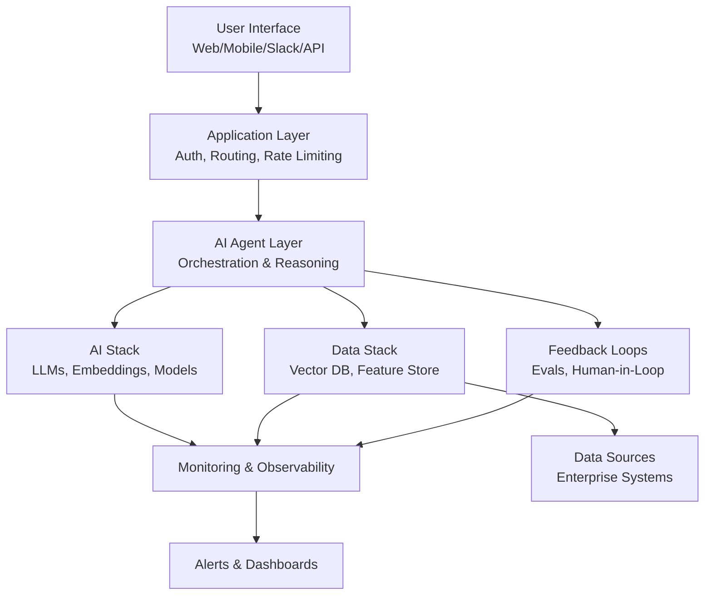
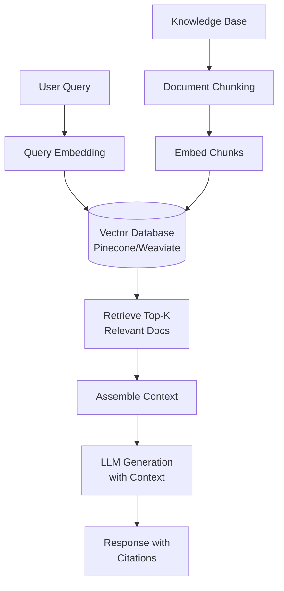
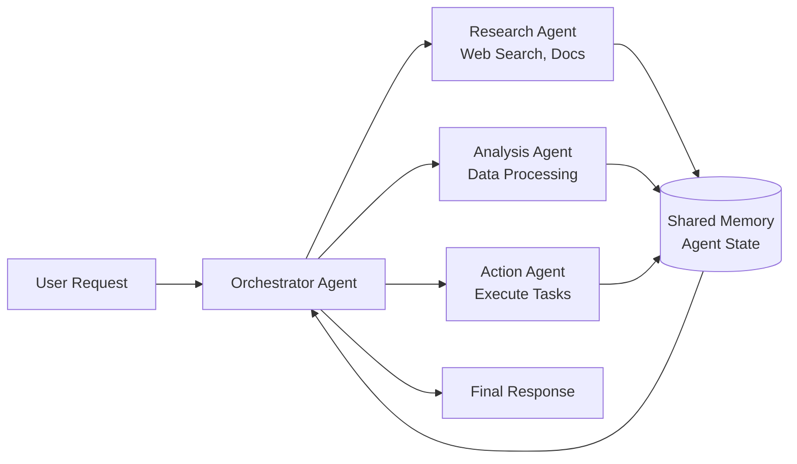

# Technical Architecture Guide for AI Use Cases

> **Reference for creating high-level system diagrams and component specifications**
> Suitable for executive and PM audiences, not detailed engineering design

---

## Diagram Patterns

### Pattern 1: Standard AI Application Architecture

**ASCII Diagram**:
```
+-----------------------------------------------------------------+
|                      USER INTERFACE LAYER                        |
|  Web App | Mobile App | Slack/Teams | API | Embedded Widget     |
+----------------------------+------------------------------------+
                             |
+----------------------------v------------------------------------+
|                    APPLICATION LAYER                            |
|  • Authentication & Authorization (SSO, RBAC)                   |
|  • Request Routing & Load Balancing                             |
|  • Rate Limiting & Throttling                                   |
|  • Session Management                                           |
|  • Human-in-Loop Orchestration                                  |
+----------------------------+------------------------------------+
                             |
+----------------------------v------------------------------------+
|                       AI AGENT LAYER                            |
|  • Agent Orchestration (Multi-Agent Coordination)               |
|  • Reasoning & Planning                                          |
|  • Tool Selection & Execution                                    |
|  • Response Generation & Formatting                             |
+------+---------------------+--------------------+---------------+
       |                     |                    |
+------v------+      +-------v------+       +-----v-------+
|   AI STACK   |      | DATA STACK  |       |  FEEDBACK   |
|              |      |             |       |   LOOPS     |
| • LLM APIs   |      | • Vector DB |       | • Evals     |
| • Embeddings |      | • Feature   |       | • Human     |
| • Fine-tuned |      |   Store     |       |   Feedback  |
|   Models     |      | • Data Lake |       | • Metrics   |
| • Guardrails |      | • Pipelines |       | • Retraining|
+------+-------+      +------+------+       +------+------+
       |                     |                     |
+------v---------------------v---------------------v------+
|            MONITORING & OBSERVABILITY LAYER               |
|  • Performance (Latency, Throughput, Errors)              |
|  • Cost (Token usage, API costs, Infrastructure)          |
|  • Quality (Accuracy, Relevance, Hallucination Rate)      |
|  • Safety (Guardrails, Bias, Harmful Content)             |
|  • Compliance (Audit Trail, Data Lineage, Policies)       |
+------^---------------------^---------------------^-------+
       |                     |                     |
+------+---------------------+---------------------+-------+
|                     DATA SOURCES                           |
|  Enterprise Systems | APIs | Databases | Real-time Streams|
+------------------------------------------------------------+
```

**Mermaid Diagram**:


---

### Pattern 2: RAG (Retrieval-Augmented Generation) Architecture

**ASCII Diagram**:
```
User Query
    |
    v
+---------------+
| Query         |
| Understanding |  <- LLM analyzes intent
+-------+-------+
        |
        v
+---------------+
| Embedding     |  <- Convert query to vector
| Generation    |
+-------+-------+
        |
        v
+---------------+
| Vector Search |  <- Search knowledge base
| (Top-K)       |     (Pinecone/Weaviate/Chroma)
+-------+-------+
        |
        v
+---------------+
| Context       |  <- Retrieved docs + metadata
| Assembly      |
+-------+-------+
        |
        v
+---------------+
| LLM           |  <- Generate response with context
| Generation    |     + citations
+-------+-------+
        |
        v
    Response with Citations
```

**Mermaid Diagram**:


---

### Pattern 3: Multi-Agent System Architecture

**Mermaid Diagram**:


---

## Component Specifications

### 1. User Interface Layer

**Components**:
- Web application (React, Vue, Angular)
- Mobile apps (iOS, Android, React Native)
- Chat interfaces (Slack, Teams, Discord)
- API endpoints (REST, GraphQL)
- Embedded widgets (iframe, SDK)

**Key Considerations**:
- Responsive design for multi-device
- Accessibility (WCAG compliance)
- Progressive disclosure (hide AI complexity)
- Human-in-loop controls (approve/reject, feedback)
- Real-time updates (websockets for long-running AI)

---

### 2. Application Layer

**Authentication & Authorization**:
- SSO integration (SAML, OAuth 2.0)
- Role-based access control (RBAC)
- API key management for developers
- Session management and token refresh

**Request Management**:
- Load balancing across AI infrastructure
- Rate limiting (per user, per tier, system-wide)
- Request queuing for batch processing
- Timeout handling and retries

**Human-in-Loop Orchestration**:
- Approval workflows (route to human when confidence <X%)
- Escalation triggers (complexity, sensitivity)
- Audit trail (log all human decisions)

---

### 3. AI Agent Layer

**Agent Orchestration**:
- **Framework**: LangChain, AutoGen, CrewAI, Custom
- **Coordination**: Message passing, shared state, event-driven
- **Planning**: Multi-step task decomposition
- **Tool Selection**: Dynamic tool invocation based on task

**Reasoning & Planning**:
- Chain-of-thought prompting
- ReAct (Reasoning + Acting) pattern
- Tree of thought for complex decisions
- Self-reflection and error correction

**Tool Integration**:
- API connectors (REST, GraphQL)
- Database queries (SQL, NoSQL)
- Search engines (web search, internal search)
- Code execution sandboxes

---

### 4. AI Stack

**LLM APIs**:
- **Providers**: OpenAI, Anthropic, Azure OpenAI, AWS Bedrock
- **Models**: GPT-4, Claude, Llama, Mistral
- **Routing**: Simple queries → cheaper models, complex → expensive
- **Caching**: Prompt caching, response caching

**Embedding Models**:
- **Purpose**: Convert text to vectors for semantic search
- **Models**: OpenAI Ada, Sentence Transformers, Cohere
- **Dimension**: 768, 1536, or custom

**Fine-Tuned Models**:
- **When**: Domain-specific language, proprietary workflows
- **Trade-offs**: Higher accuracy vs. maintenance burden
- **Hosting**: Cloud (SageMaker, Vertex) vs. Self-hosted

**Guardrails**:
- Input filtering (harmful prompts, PII detection)
- Output filtering (toxicity, bias, brand violations)
- Content moderation (NSFW, violence, hate speech)

---

### 5. Data Stack

**Vector Database**:
- **Options**: Pinecone, Weaviate, Chroma, Qdrant, Milvus
- **Scale**: Millions to billions of vectors
- **Features**: Similarity search, filtering, hybrid search

**Feature Store**:
- **Purpose**: Centralized feature management for ML
- **Tools**: Feast, Tecton, AWS Feature Store
- **Features**: Versioning, lineage, online/offline serving

**Data Pipelines**:
- **Ingestion**: Real-time streaming (Kafka, Kinesis) or batch ETL
- **Transformation**: dbt, Apache Spark, Airflow
- **Quality**: Validation, deduplication, anomaly detection

**Data Lakehouse**:
- **Storage**: S3, Azure Data Lake, GCS
- **Query**: Athena, BigQuery, Snowflake
- **Governance**: Access control, encryption, retention policies

---

### 6. Feedback Loops

**Evaluation Systems**:
- **Offline**: LLM-as-judge, human evaluation on sample
- **Online**: A/B testing, user feedback (thumbs up/down)
- **Metrics**: Groundedness, relevance, hallucination rate

**Human Feedback Collection**:
- In-app thumbs up/down buttons
- Correction interfaces (user edits AI output)
- Detailed feedback forms (multi-dimensional ratings)

**Model Retraining**:
- Trigger: Performance degradation, data drift, scheduled
- Process: Collect feedback → retrain → evaluate → deploy
- Versioning: Track model versions and rollback capability

---

### 7. Monitoring & Observability

**Performance Monitoring**:
- **Tools**: DataDog, New Relic, Prometheus + Grafana
- **Metrics**: Latency (p50, p95, p99), throughput, error rates
- **Dashboards**: Real-time operational view

**Cost Monitoring**:
- Token usage tracking (input/output tokens per request)
- API cost aggregation (daily, monthly rollups)
- Infrastructure cost attribution

**Quality Monitoring**:
- Model accuracy tracking over time
- Hallucination detection (automated checks)
- User satisfaction scores (CSAT, NPS)

**Safety Monitoring**:
- Guardrail trigger frequency
- Harmful content detection rate
- Security incident tracking (prompt injection attempts)

---

## Integration Points

### Enterprise System Integrations

**CRM Integration** (Salesforce, HubSpot):
- Sync customer data for personalization
- Update records based on AI insights
- Trigger workflows from AI actions

**Support Systems** (Zendesk, Intercom):
- Read ticket context for AI responses
- Auto-categorize and route tickets
- Update ticket status and resolution

**Data Warehouses** (Snowflake, BigQuery):
- Query historical data for context
- Write AI predictions back for analytics
- Train models on aggregated data

**Authentication** (Okta, Active Directory):
- SSO for user login
- RBAC for feature access
- Audit trail for compliance

---

## Scalability Patterns

### Horizontal Scaling

**Application Layer**:
- Auto-scaling based on request rate
- Load balancer (ALB, nginx) distributes traffic
- Stateless services for easy replication

**AI Inference**:
- Model serving on Kubernetes (KServe, Seldon)
- GPU auto-scaling for variable workloads
- Batch inference for non-real-time use cases

### Caching Strategies

**Response Caching**:
- Cache identical queries for X hours
- Semantic cache (similar queries → same response)
- Invalidation strategy (time-based, event-based)

**Embedding Caching**:
- Cache document embeddings (expensive to compute)
- Update only when content changes
- Distributed cache (Redis, Memcached)

**Prompt Caching** (Provider-Specific):
- OpenAI/Anthropic prompt caching
- Cache system prompts and few-shot examples
- Reduce token costs by 50-90%

### Cost Optimization

**Model Routing**:
- Route simple queries to GPT-3.5, complex to GPT-4
- Use smaller models (Claude Haiku) for straightforward tasks
- Confidence-based routing (low confidence → expensive model)

**Batch Processing**:
- Aggregate non-urgent requests into batches
- Lower API costs with batch endpoints
- Trade latency for cost savings

---

## Architecture Checklist

**Functional Requirements**:
- [ ] User authentication and authorization
- [ ] AI request processing and response generation
- [ ] Human-in-loop workflows where needed
- [ ] Integration with required enterprise systems
- [ ] Feedback collection and model improvement

**Non-Functional Requirements**:
- [ ] Performance: Latency targets (p95 <Xms)
- [ ] Scalability: Handle Nx current load
- [ ] Availability: 99.9% uptime SLA
- [ ] Security: Encryption, access control, audit logs
- [ ] Cost: Unit economics targets ($X per user)

**AI-Specific Requirements**:
- [ ] Model versioning and rollback capability
- [ ] A/B testing infrastructure for model updates
- [ ] Guardrails for safety and compliance
- [ ] Evaluation and monitoring systems
- [ ] Responsible AI compliance (bias, fairness, transparency)

---

## Example Architectures by Use Case Type

### Q1 (BI/Diagnostic AI): Analytics Dashboard
- Simple architecture: Data warehouse → ML model → Visualization
- No agentic layer needed
- Focus: Data quality, model accuracy, dashboard UX

### Q2 (In-Context AI): Personalized Recommendations
- Real-time inference architecture
- Features: User history, item embeddings, collaborative filtering
- Scale: Serve millions of requests per second

### Q3 (Fixed Workflows): AI-Assisted Content Creation
- Human-in-loop architecture
- Workflow: AI generates → Human reviews → Approve/Edit → Publish
- Key: Approval queues, versioning, audit trail

### Q4 (Autonomous Agents): Customer Support Chatbot
- Fully agentic architecture
- Components: NLU, dialog management, knowledge base, action execution
- Monitoring: Conversation quality, escalation rate, resolution time

---

**Version**: 1.0
**Last Updated**: October 2025
